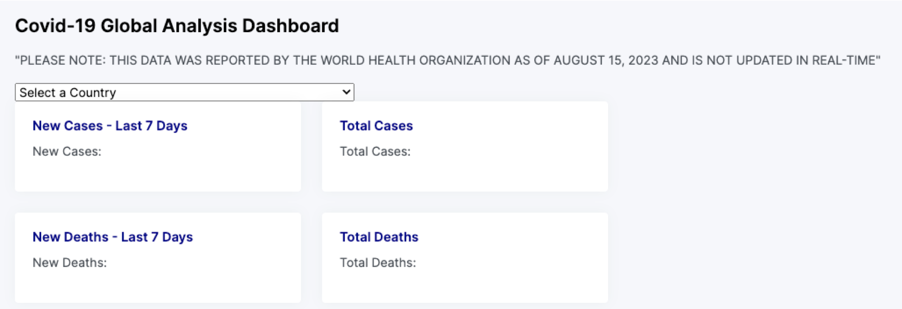
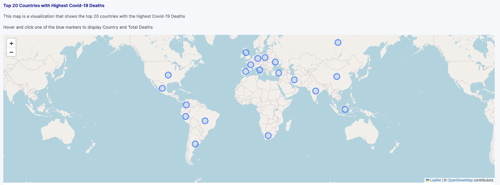
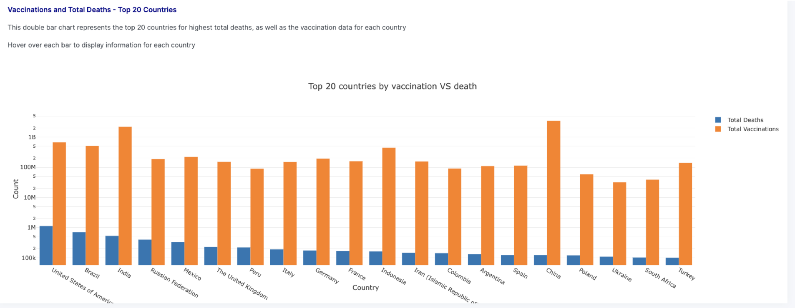
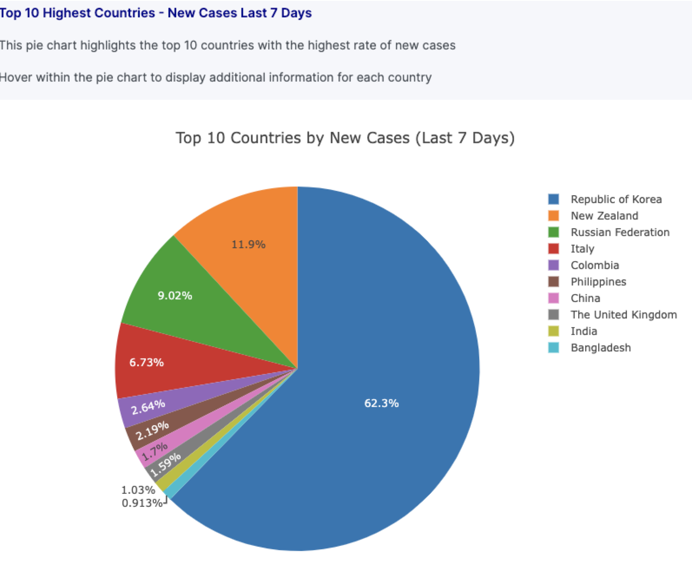

# Covid-Analysis-Project-3
Visualizations using JavaScript libraries

**Project Contributors:**
Aisha Henderson, Rajeshwari Radhakrishna and Kelly Blake

**Project Description**
The goal of this project was to create an interactive dashboard that allows end-users to view and explore COVID-19 data by country. We utilized the below-referenced datasets to understand the differences and global impact of COVID-19 over time.

For the purpose of our research, we will be looking at areas such as total cases, total deaths, total vaccinations and new/active cases to compare and contrast this data between each country.

**Datasets Utilized:**
Daily Cases and Deaths by Date (1) // Vaccination Data (2)
Datasets Utilized:
https://covid19.who.int/WHO-COVID-19-global-data.csv
https://covid19.who.int/who-data/vaccination-data.csv

**Project Parameters:**

1. Our visualization includes a Python Flask-powered API, HTML/CSS, JavaScript, and Postgres SQL Database.

2. For this project, we opted to create a dashboard with multiple charts, and a dropdown that updates data based on country selected. 
    
3. The JavaScript libraries used in creation of the dashboard include:
       -D3
       -Plotly
       -Leaflet
       -Bootstrap

4. The World Health Organization (WHO) datasets that were utilized included around 237 rows of data for extraction, transformation and analysis (ETL)

5.  The views in the dashboard include:
      - A map of the Top Twenty Countries with Highest Deaths resulting from COVID-19

            **Key Findings:** While it was known to us that the U.S. had the highest total deaths, we were surprised to see some of the other countries that deaths close to 1 million. At the same time, it was also interesting to note that based on this data, the U.S. was the only country with over 1 million total deaths.

      - A bar chart of the Top Twenty Countries with the Highest Deaths vs. The Total Vaccinations for those countries

            **Key Findings:** This chart adds a layer of vaccination information to the countries with the highest total deaths. Some of the countries with the highest total vaccinations (initial dose) include China, India, the U.S. and Brazil.

      - A pie chart showing the Top Ten Countries with the Highest Rate of New Cases in the Last 7 Days

            **Key Findings:** This chart was most surprising, due to how the data is spread out. The Republic of Korea has the most new cases within the last 7 days, with 62.3%, compared to the other 9 Countries analyzed. One thing we noticed upon reviewing the dataset is that this information may be skewed due to under-reported new cases. Several countries in the WHO dataset did not have reported new cases, even though we know this is not the case. 
            
      - Additionally, there is a summary view that includes a dropdown of all countries. Upon selecting a country, data for each populates to show Total Cases, Total Deaths, New Cases, and New Deaths 

### REFERENCES

**References for Code Syntax and Issue Resolution**
1. Python AttributeError: type object “datetime.datetime” no attribute “datetime.” (n.d.). Statistics Globe. Retrieved August 28, 2023, from https://statisticsglobe.com/type-object-datetime-has-no-attribute-python

2. Class Repository and TA Assistance:

    https://git.bootcampcontent.com/University-of-Texas-at-Austin/UTA-VIRT-DATA-PT-04-2023-U-LOLC/-/tree/main/01-Lesson-Plans
    TA's - Nathan Darter; Trisha Mallya
    Initial Template and file structure (courtesy of Nathan Darter) -- https://github.com/nedarter/SimpleFlaskApp/tree/main
    

4. Dropdown and Event Listener Syntax Resources:

      JavaScript DOM EventListener. (n.d.). Www.w3schools.com. https://www.w3schools.com/js/js_htmldom_eventlistener.asp

      olawanletjoel. (2022, September 26). HTML Drop-down Menu – How to Add a Drop-Down List with the Select Element. FreeCodeCamp.org. https://www.freecodecamp.org/news/html-drop-down-menu-how-to-add-a-drop-down-list-with-the-select-element/

      How to get selected value in dropdown list using JavaScript ? (2019, May 30). GeeksforGeeks. https://www.geeksforgeeks.org/how-to-get-selected-value-in-dropdown-list-using-javascript/

      Fill dropdown list with json. (n.d.). Stack Overflow. Retrieved August 28, 2023, from https://stackoverflow.com/questions/6532791/fill-dropdown-list-with-json

5. Reading in a JSON file to Python Syntax Resource:

      Read JSON file using Python. (2019, December 17). GeeksforGeeks. https://www.geeksforgeeks.org/read-json-file-using-python/

**HTML AND CSS TEMPLATES**
1. Templates for the CSS and HTML sourced from AdminKit Boostrap, and Modified for this Project

    30+ Open-Source and Free Dashboard Templates. (2020, March 25). Creative Tim’s Blog - Fully Coded Design Resources for Web Developers. https://www.creative-tim.com/blog/web-design/free-dashboard-templates/

**DATASET AND INFORMATIONAL RESOURCES**
1.  World Health Organization. (2021). WHO Coronavirus (COVID-19) Dashboard. Who.int. https://covid19.who.int/data

2. CDC. (2020, March 28). COVID Data Tracker. Centers for Disease Control and Prevention. https://covid.cdc.gov/covid-data-tracker/#nationwide-blood-donor-seroprevalence-2022

3. (2020). Who.int. https://covid19.who.int/WHO-COVID-19-global-data.csv

4. (2022). Who.int. https://covid19.who.int/who-data/vaccination-data.csv

**PRESENTATION DESIGN TEMPLATE**
1. Canva. (2023). Canva. Canva. https://www.canva.com/

### Dashboard Components - Screenshots 

**Country Selector Dropdown**

**World Map  - Top 20 Countries with Highest Covid Deaths**
Includes hover tooltip with country and number of deaths 

**Bar Chart of Vaccinations and Total Deaths - Top 20 Countries**

**Pie Chart of Top 10 Highest Countries - New Cases Last 7 Days**

### Conclusion
The COVID-19 pandemic has significantly impacted the world, leading to widespread illness, loss of life, and disruptions across various aspects of society

Visualization of relevant data serves as a benefit to those on the front-lines and behind the scenes by providing the most up-to-date information 

While we assessed specific items for each country, there are still many layers that could be added to visualize and uncover trends throughout the pandemic.

As the pandemic is still very much ongoing, looking at the data, particularly vaccine data and new cases for each country can help in forecasting and mitigating additional variants or spread of this virus.

